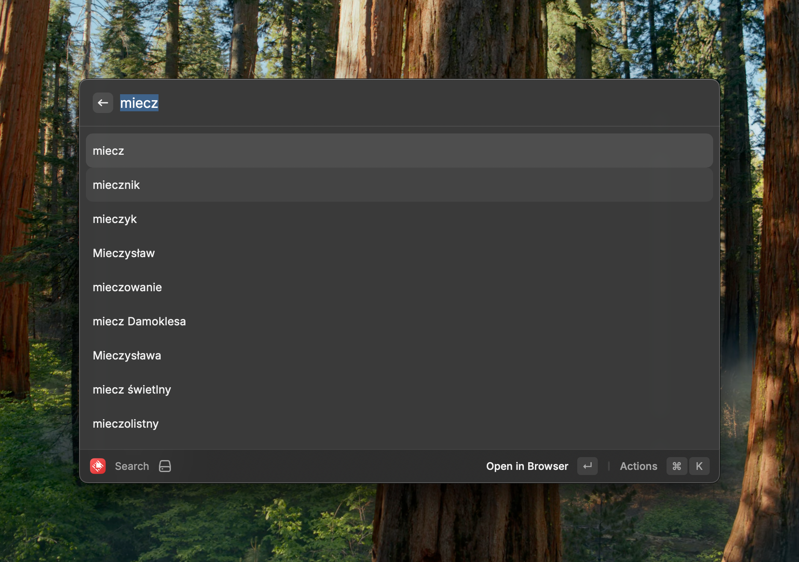
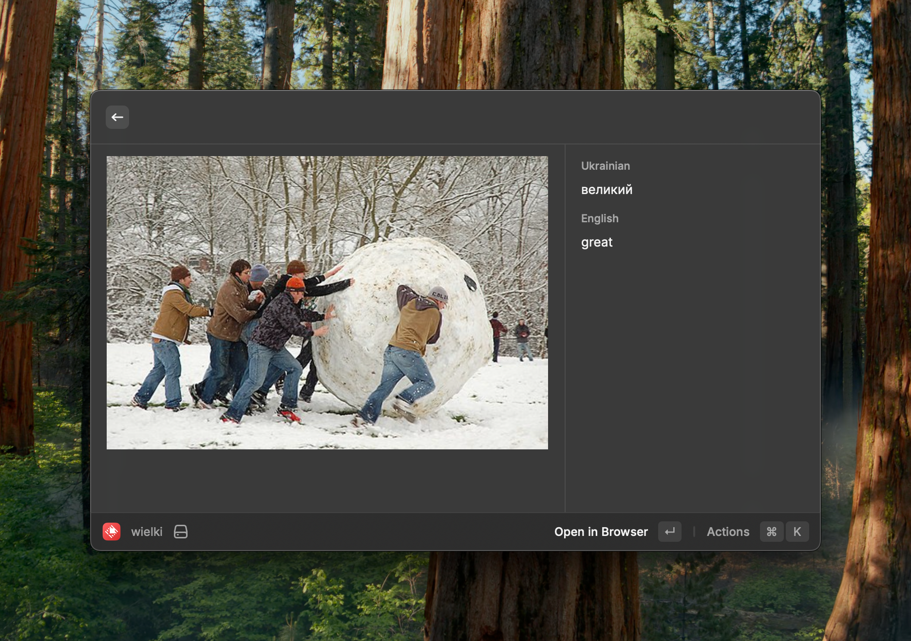
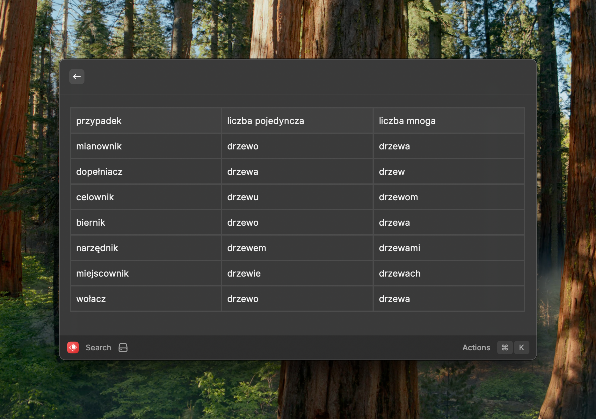
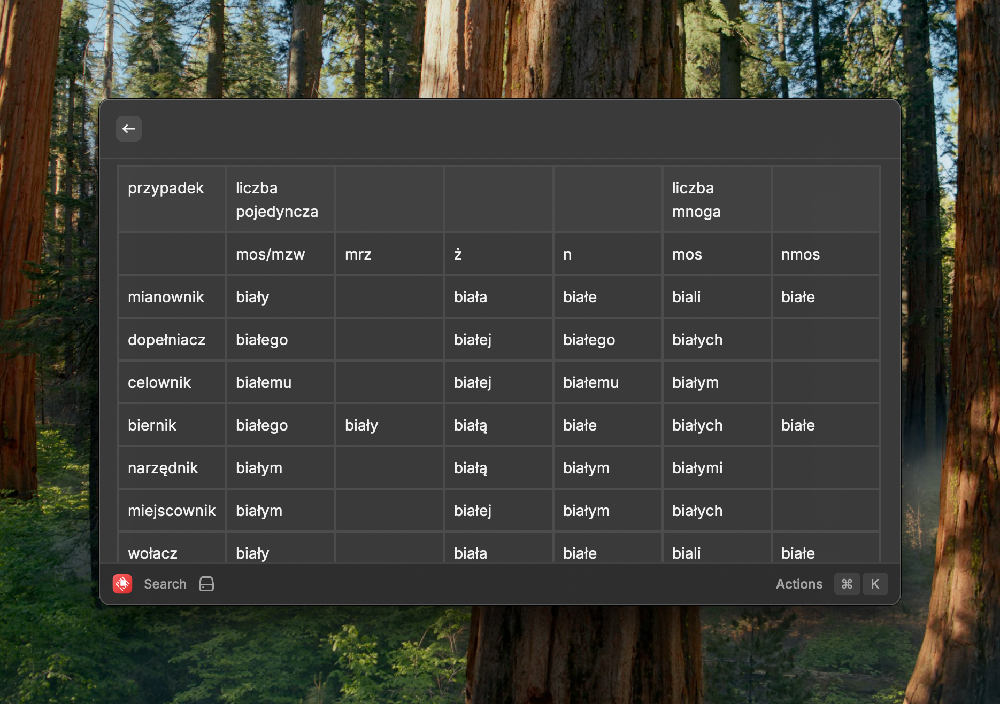
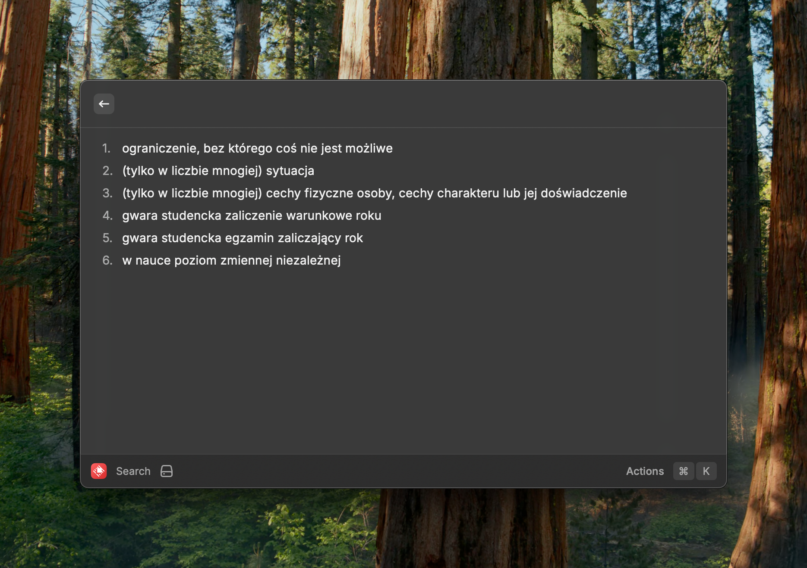

# Wikisłownik for Raycast

A Raycast extension for the Polish Wiktionary (Wikisłownik) that allows you to quickly search and view dictionary entries.

## Features

- Fast search of Polish Wiktionary entries
- View word definitions, examples, and conjugation tables
- Support for different parts of speech and language variants

<details>
<summary>Screenshots</summary>






</details>

## Installation

1. Make sure you have [Raycast](https://raycast.com/) installed
2. Clone this repository
3. Navigate to the project directory
4. Install dependencies:
   ```bash
   npm install
   ```
5. Start development server:
   ```bash
   npm run dev
   ```

## Commands

- `Search`: Search for a word in the Polish Wiktionary

## Development

This extension is built with:
- TypeScript
- React
- Raycast API
- Node HTML Parser

### Available Scripts

- `npm run dev`: Start the development server
- `npm run build`: Build the extension
- `npm run lint`: Check for lint issues
- `npm run fix-lint`: Fix lint issues automatically
- `npm test`: Run the test suite

## Contributing

Contributions are welcome! Please feel free to submit a Pull Request.

## License

This project is licensed under the MIT License - see the LICENSE file for details.